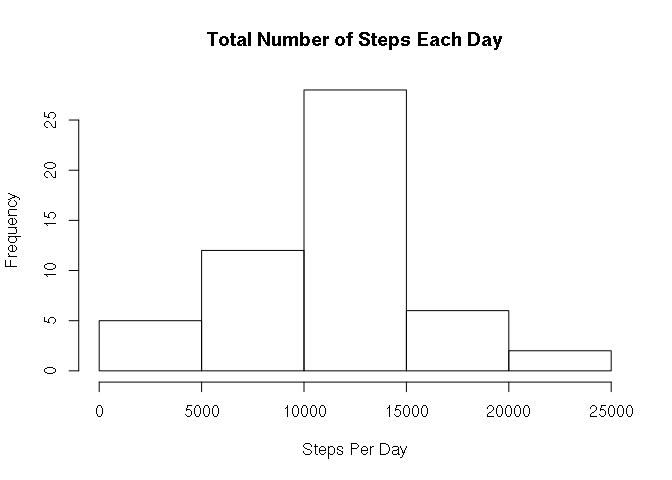
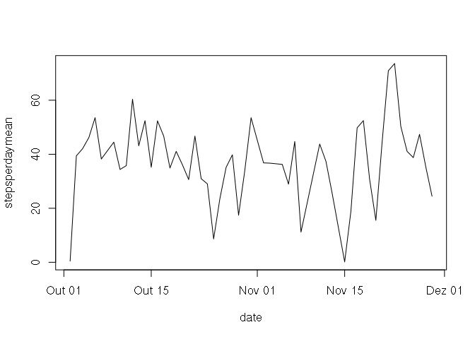
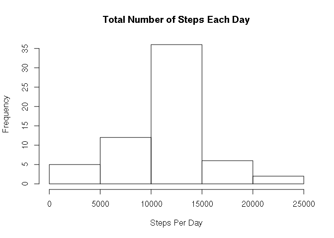
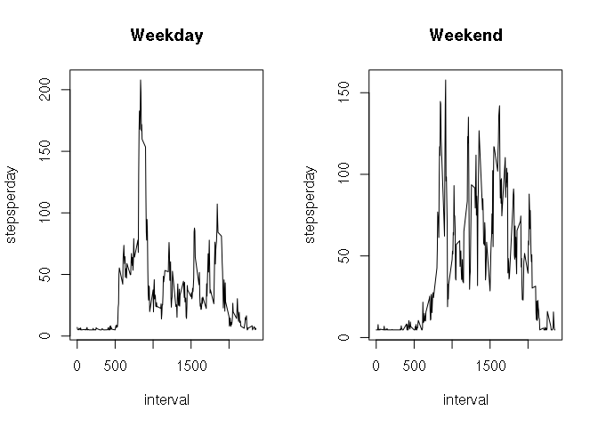

## Loading and preprocessing the data


```r
setwd("./")

unzip("activity.zip")

# Reading the dataset

MyData <- read.csv("activity.csv")

# Brief summary of data

summary(MyData)
```

```
##      steps                date          interval     
##  Min.   :  0.00   2012-10-01:  288   Min.   :   0.0  
##  1st Qu.:  0.00   2012-10-02:  288   1st Qu.: 588.8  
##  Median :  0.00   2012-10-03:  288   Median :1177.5  
##  Mean   : 37.38   2012-10-04:  288   Mean   :1177.5  
##  3rd Qu.: 12.00   2012-10-05:  288   3rd Qu.:1766.2  
##  Max.   :806.00   2012-10-06:  288   Max.   :2355.0  
##  NA's   :2304     (Other)   :15840
```


## What is mean total number of steps taken per day?


```r
MyData$Date <- as.Date(MyData$date)

StepsPerDay <- aggregate(MyData$steps, by=list(MyData$Date), sum)

StepsPerDayTotal1 <- sum(StepsPerDay$stepsperday)

# Changing the variable's names

names(StepsPerDay) <- c("date", "stepsperday")

hist(StepsPerDay$stepsperday, main = "Total Number of Steps Each Day",xlab = "Steps Per Day")
```

<!-- -->

```r
# Calculating the mean 

Mean <- mean(StepsPerDay$stepsperday,na.rm = TRUE)
Mean
```

```
## [1] 10766.19
```

```r
# and the median

Median <- median(StepsPerDay$stepsperday,na.rm = TRUE)
Median
```

```
## [1] 10765
```

#### The mean value is 1.0766189\times 10^{4} and the  median value is 10765 .


## What is the average daily activity pattern?


```r
StepsPerDayMean <- aggregate(MyData$steps, by=list(MyData$Date), mean)

# Changing the variable's names

names(StepsPerDayMean) <- c("date", "stepsperdaymean")

StepsPerDayMean <-StepsPerDayMean[!is.na(StepsPerDayMean$stepsperdaymean),] 

plot(StepsPerDayMean, type="l")
```

<!-- -->

```r
#  The 5-minute interval, on average across all the days in the dataset, contains  the   maximum number of steps

MyDataNona <-MyData[!is.na(MyData$steps),] 

StepsPerIntervalMean <-aggregate(MyDataNona$steps, by=list(MyDataNona$interval), mean)

# Changing the variable's names

names(StepsPerIntervalMean) <- c("interval", "stepsperintervalmean")

StepMean <- StepsPerIntervalMean[which.max(StepsPerIntervalMean$stepsperintervalmean),]
StepMean 
```

```
##     interval stepsperintervalmean
## 104      835             206.1698
```


#### The 5-minute interval thatcontains  the   maximum number of steps is between  835 and 840.

## Imputing missing values


```r
MyDataNumberNA <- length(MyData[is.na(MyData)])
```

#### The number of NAs in the dataset is 2304 .


```r
# Determining the average of the intervals, IntervalMean.

IntervalMean <- mean(StepsPerIntervalMean$stepsperintervalmean)

# Substituindo os NAs pelo  valor médio dos intervalos. 

MyData$steps[is.na(MyData$steps)] <- IntervalMean


StepsPerDay <- aggregate(MyData$steps, by=list(MyData$date), sum)

# Changing the variable's names

names(StepsPerDay) <- c("date", "stepsperday")

hist(StepsPerDay$stepsperday, main = "Total Number of Steps Each Day",xlab = "Steps Per Day")
```

<!-- -->

```r
# Calculating the mean 

Mean <- mean(StepsPerDay$stepsperday,na.rm = TRUE)
Mean
```

```
## [1] 10766.19
```

```r
# and median

Median <- median(StepsPerDay$stepsperday,na.rm = TRUE)
Median
```

```
## [1] 10766.19
```
 
#### After NA replacement, the mean did not change, while the median increased slightly
 

```r
StepsPerDayTotal2 <- sum(StepsPerDay$stepsperday)

# The difference between the total number of steps before and after replacing the Nas by the average value of the intervals.

Diff <- StepsPerDayTotal2 - StepsPerDayTotal1
Diff
```

```
## [1] 656737.5
```

#### The total number of steps increased by a value of 6.5673751\times 10^{5} after the Nas replacement.


## Are there differences in activity patterns between weekdays and weekends?


```r
Sys.setlocale("LC_TIME", "en_US.UTF-8")
```

```
## [1] "en_US.UTF-8"
```

```r
MyData$Date <-  weekdays(MyData$Date)

MyData$Date[MyData$Date %in% c("Monday" , "Tuesday", "Wednesday", "Thursday","Friday")] <-"weekday"

MyData$Date[MyData$Date %in% c("Saturday" , "Sunday")] <-"weekend"

MyData$date <- as.Date(MyData$date)


# Subsetting

StepsPerDayWeekday <- MyData[grepl("weekday", MyData$Date),] 

StepsPerDayWeekend <- MyData[grepl("weekend", MyData$Date),] 


StepsPerDayMeanWeekday <- aggregate(StepsPerDayWeekday$steps, by=list(StepsPerDayWeekday$interval), mean)

StepsPerDayMeanWeekend <- aggregate(StepsPerDayWeekend$steps, by=list(StepsPerDayWeekend$interval), mean)

# Changing the variable's names

names(StepsPerDayMeanWeekday) <- c("interval", "stepsperday")

names(StepsPerDayMeanWeekend) <- c("interval", "stepsperday")

# Ploting

par(mfrow=c(1,2))

plot(StepsPerDayMeanWeekday ,type="l", main="Weekday")

plot(StepsPerDayMeanWeekend ,type="l", main="Weekend")
```

<!-- -->


